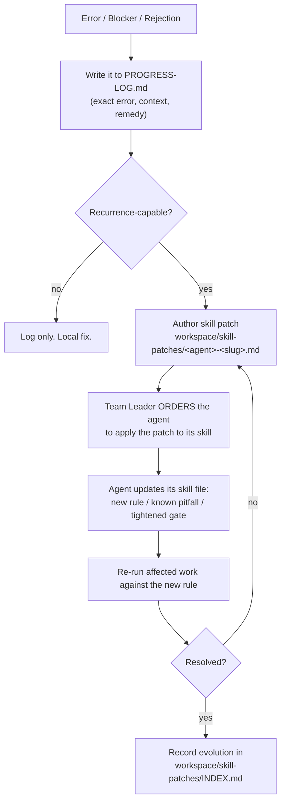

# Skill Evolution — Turning Errors into Permanent Capability

Rule R6: **fixing a bug locally is not enough.** If the error could recur on another
project, the Team Leader orders a *skill evolution* — a permanent change to the
responsible agent's skill so the same class of error never happens twice.

> This is the mechanism that makes the team behave like 20–40 year veterans:
> experience is not time served, it is **lessons written down and enforced**.

---

## 1. Trigger Conditions

An evolution is **mandatory** when any of these occur:

1. An error → fix cycle happened (build failure, test failure, runtime error).
2. A gate was **rejected** (G2/G5/G6/G7/G8).
3. An integrity invariant was violated.
4. A dependency/tool/API behaved differently than the plan assumed.
5. The same class of problem appeared more than once in the run.

**Non-triggers** (local fix is enough, but still log it): a typo, a one-off
environment quirk that cannot recur, a deliberate user-requested change.

---

## 2. The Evolution Loop



---

## 3. Skill Patch Format

Write to `workspace/skill-patches/<agent>-<slug>.md` (template in
`templates/skill-patch.md`):

```markdown
# Skill Patch: <agent> — <short title>

- Date: YYYY-MM-DD
- Run: workspace/runs/<run>/
- Agent: <agentId>
- Origin: <error | gate-rejection | integrity-violation | research-gap>
- Recurrence risk: <high | medium | low>

## 1. What happened (verbatim)
<Exact error text / rejection quote. Context: what the agent was doing.>

## 2. Root cause
<Why it happened — not the symptom. Trace to the rule that was missing or unclear.>

## 3. Local fix applied
<What was changed in the code/artifact, with file:line.>

## 4. Permanent skill change (the evolution)
- Target file: reference/<file>.md | agents/<agent>.md | SKILL.md
- Change type: new-rule | known-pitfall | tightened-gate | clarified-standard
- Exact text to add/modify:
  <the literal markdown block to insert>

## 5. Verification
<Command run + output proving the affected work is now clean, and the rule now exists.>

## 6. Order
Ordered by team-leader on YYYY-MM-DD. Status: <applied | pending>
```

---

## 4. Where Evolutions Land

| Change type | Target |
| :--- | :--- |
| A new behavioral rule for one agent | `agents/<agent>.md` → "## Known Pitfalls" / "## Integrity Rules" |
| A new gate check everyone must pass | `reference/standards.md` or `reference/workflow.md` |
| A clarified deliverable requirement | `reference/documentation-contract.md` |
| An orchestration fix (spawn/await/ordering) | `reference/orchestration-tools.md` or `SKILL.md` |
| A domain heuristic worth generalizing | `reference/industry-baselines.md` |

---

## 5. Index and Governance

- Every patch is listed in `workspace/skill-patches/INDEX.md` with date, agent, title, status.
- Patches are **ordered by the Team Leader only** — agents may propose, never self-apply (R2).
- A patch is `applied` only when the target skill file literally contains the change and
  the affected work re-ran clean.
- Evolutions are additive by default. Removing a rule requires a recorded ADR in `DECISIONS.md`.

---

## 6. Anti-Patterns (rejected)

- **Silent fix**: patching code, moving on, no skill change. → Rejected (R6).
- **Vague rule**: "be more careful with X." → Rejected; the rule must be checkable.
- **Over-fitting**: a rule so specific it only fits one run. → Rejected; generalize.
- **Rule bloat**: 40 near-duplicate rules. → Merge into one checkable rule.
