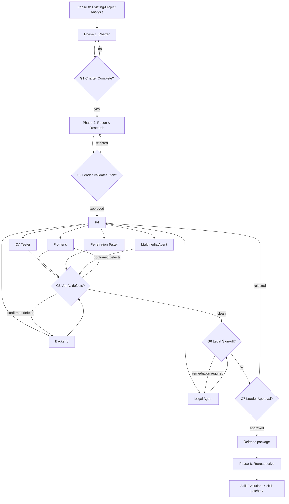

# Workflow — Phases, Gates, and Parallelization

This is the canonical operating procedure. `SKILL.md` executes it; agents obey it.

---

## 1. Phase Table

| # | Phase | Owner | Parallel? | Output | Gate |
| :-- | :--- | :--- | :--- | :--- | :--- |
| X | Existing-Project Analysis | Team Leader | no | `EXISTING-PROJECT-ANALYSIS.md` | GX |
| 1 | Charter | Team Leader | no | charter set (see below) | G1 |
| 2 | Recon & Research | Planner+Researcher | no | research, flowchart, plan | — |
| 3 | Plan Validation | Team Leader | no | verdict | **G2** |
| 4 | Build | FE, BE, QA, PT, Legal, MM | **yes** | code + per-agent artifacts | — |
| 5 | Verification | QA + Pentest (+FE/BE fixes) | partly | test + security reports | **G5** |
| 6 | Legal Sign-off | Legal | no | legal review | **G6** |
| 7 | Final Approval | Team Leader | no | approval ledger | **G7** |
| 8 | Retrospective | Team Leader + all | no | skill patches | **G8** |

**Charter set (Phase 1):** `PROJECT-CHARTER.md`, `REQUIREMENTS.md`, `ARCHITECTURE.md`,
`TECH-STACK.md`, `CONTEXT.md`, `DECISIONS.md`, `APPROVALS.md`.

---

## 2. Dependency Graph



---

## 3. Gate Definitions

A gate is a **decision recorded in `APPROVALS.md`**. Unrecorded approval does not exist.

| Gate | Question | Passes when | Fails when |
| :--- | :--- | :--- | :--- |
| **GX** | Do we understand the existing system? | Analysis doc covers structure, deps, data, auth, CI, risks | Any unknown entry point or dependency |
| **G1** | Is the charter complete and coherent? | All 7 charter artifacts exist, requirements testable, stack justified | Missing doc, untestable requirement, unjustified choice |
| **G2** | Does research match our standards? | All 6 checks in `SKILL.md` Phase 3 pass | Any box unchecked |
| **G5** | Is it verified? | All acceptance tests pass; no unfixed Critical/High security finding | Weak/skipped tests, open Critical/High |
| **G6** | Is it legally clear? | License + privacy + IP cleared | Incompatible license, unresolved data-compliance obligation |
| **G7** | Is the whole run defensible? | Every agent artifact complete, logged, evidenced, in-lane | Missing artifact, silent failure, integrity violation |
| **G8** | Did we learn? | Every recurrence-capable error produced a skill patch | An error left as a one-off local fix |

---

## 4. Parallelization Rules

Run in parallel only when there is **no data dependency between the outputs**.

- FE and BE run in parallel **after** the API contract is stubbed.
- QA writes the plan in parallel with FE/BE, then executes after the build lands.
- Pentest starts static/threat modeling in parallel; dynamic testing waits for a runnable build.
- Legal runs fully in parallel from Phase 4 (it only needs the stack, deps, and data flows).
- Multimedia waits for `UI-SPEC.md` and a renderable UI (via QA's environment), then runs alone.

Never parallelize two agents that write the **same artifact**. One artifact, one owner.

---

## 5. Escalation

Any agent may `block` a task with a reason. Blockers go to the Team Leader, who either:
amends the plan (`DECISIONS.md`), reassigns, or descopes (recorded in `PROJECT-CHARTER.md`).
An agent must never resolve a blocker by departing from the approved plan (R1).

---

## 6. Approval Ledger Format (`APPROVALS.md`)

```markdown
### [G2] Plan Validation — 2026-02-10 — APPROVED
- Gate: G2 (Plan Validation)
- Submitted by: planner-researcher
- Artifacts: docs/RESEARCH-REPORT.md, docs/SYSTEM-FLOWCHART.md, docs/PROJECT-PLAN.md
- Standard checked: reference/standards.md §3 (Research Integrity), §4 (Requirement Traceability)
- Evidence: FR-001..FR-024 each traced to a workstream; 14 sources cited with URLs
- Verdict: APPROVED
- Remediation required: none
- Decided by: team-leader
```
