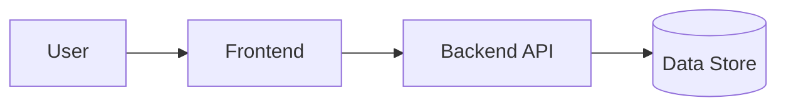

# Template: ARCHITECTURE.md

```markdown
# Architecture — <Project Name>
- Run: <run slug> | Owner: team-leader | Version: 1 | Status: draft
- Inputs: docs/REQUIREMENTS.md, docs/PROJECT-CHARTER.md

## 1. Context (C4 level 1)
<System boundary + external actors/systems. Mermaid context diagram.>

## 2. Containers / components (C4 level 2)
| Component | Responsibility | Technology | Owner agent |
| :-- | :--- | :--- | :--- |

## 3. Data flow

<Numbered narrative of the flow.>

## 4. Trust boundaries
| Boundary | Inside | Outside | Control |
| :-- | :--- | :--- | :--- |

## 5. External integrations
| Integration | Purpose | Auth | Failure behavior |
| :-- | :--- | :--- | :--- |

## 6. Failure modes
| Component | Failure | Detection | Recovery | User impact |
| :-- | :--- | :--- | :--- | :--- |

## 7. Scalability & performance posture
<Expected load, where the bottleneck will be first, the scaling lever.>

## 8. Observability
<Logs, metrics, traces, alerting, correlation.>

## 9. Security posture
<Authn, authz, secrets, encryption, input handling.>

## 10. Hardest problem (de-risk first)
<The single riskiest technical assumption and how it is validated.>

## 11. Open questions
- <question — owner — by when>
```
