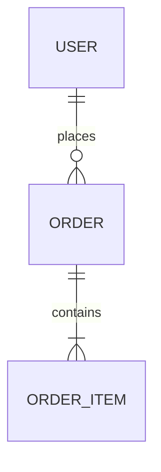

# Template: DATA-MODEL.md (Backend)

```markdown
# Data Model — <Project Name>
- Run: <run slug> | Owner: backend | Version: 1 | Status: submitted
- Inputs: docs/REQUIREMENTS.md, docs/API-CONTRACT.md, docs/CONTEXT.md

## 1. Entities
### Entity: <name>
| Attribute | Type | Constraints | Notes |
| :-- | :--- | :--- | :--- |

## 2. Relationships
| From | To | Cardinality | On delete |
| :-- | :--- | :--- | :--- |

## 3. Indexes & constraints
| Table | Index/constraint | Reason |
| :-- | :--- | :--- |

## 4. ER diagram


## 5. Migration plan
| Step | Change | Backward compatible? | Rollback |
| :-- | :--- | :--- | :--- |

## 6. Retention & PII classification
| Table/field | Contains PII? | Category | Retention | Deletion behavior |
| :-- | :--- | :--- | :--- | :--- |
```
