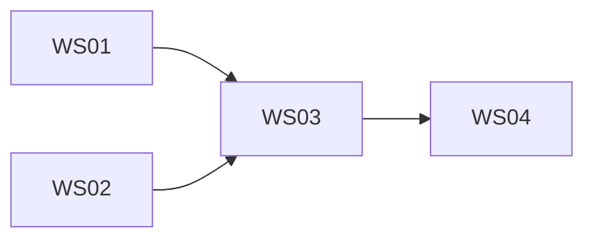

# Template: PROJECT-PLAN.md

```markdown
# Project Plan — <Project Name>
- Run: <run slug> | Owner: planner-researcher | Version: 1 | Status: submitted
- Inputs: docs/REQUIREMENTS.md, docs/RESEARCH-REPORT.md, docs/SYSTEM-FLOWCHART.md

## 1. Workstreams

### WS-01 — <name>
- Objective: <outcome>
- Owner agent: <agentId>
- Inputs: <artifact paths>
- Deliverables: <artifact + code paths>
- Definition of done: <checkable conditions>
- Depends on: <WS-## or none>

### WS-02 — <name>
<same shape>

## 2. Sequencing & critical path

Critical path: <WS-## → WS-## → ...>

## 3. Parallelization map
| Wave | Agents running in parallel | Gate after wave |
| :-- | :--- | :--- |
| 1 | frontend, backend, legal, qa (plan), pentest (static) | — |
| 2 | qa (execute), pentest (dynamic), multimedia | G5 |

## 4. Milestones
| Milestone | Criteria | Target |
| :-- | :--- | :--- |

## 5. Requirement traceability
| Requirement | Workstream | Test(s) |
| :-- | :--- | :--- |
| FR-001 | WS-01 | TC-001 |

## 6. Schedule risks
| Risk | Impact | Mitigation |
| :-- | :--- | :--- |
```
