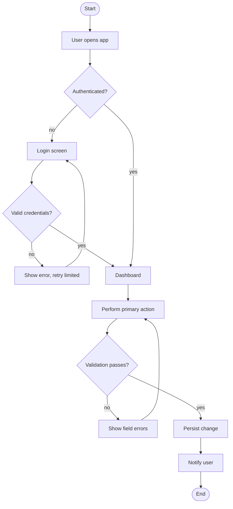

# Template: SYSTEM-FLOWCHART.md

> The Planner produces one flowchart from **start to finish**: happy path, every decision
> branch, every error/edge path, actors, external systems, and termination states.
> It must cover **every** `FR-###`. A happy-path-only diagram is rejected (R8).

```markdown
# System Flowchart — <Project Name>
- Run: <run slug> | Owner: planner-researcher | Version: 1 | Status: submitted
- Inputs: docs/REQUIREMENTS.md, docs/PROJECT-PLAN.md

## 1. Actors & external systems
| Actor/System | Type | Interaction |
| :-- | :--- | :--- |

## 2. Flowchart (start → finish)


## 3. Narrative (numbered)
1. <step — screen/component — requirement id>
2. ...

## 4. Decision branches
| # | Decision | Conditions | Outcomes |
| :-- | :--- | :--- | :--- |

## 5. Error / edge paths
| # | Path | Trigger | Handling | Requirement |
| :-- | :--- | :--- | :--- | :--- |

## 6. Requirement coverage check
| FR-### | Covered by step(s) | OK? |
| :-- | :--- | :--- |
```
